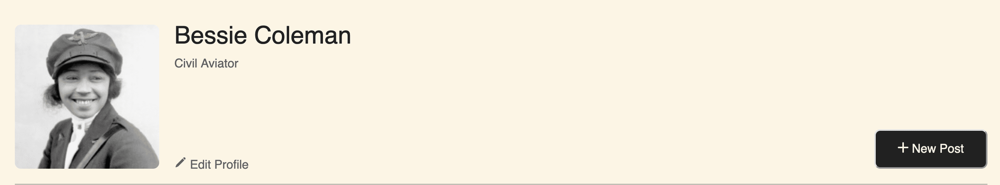
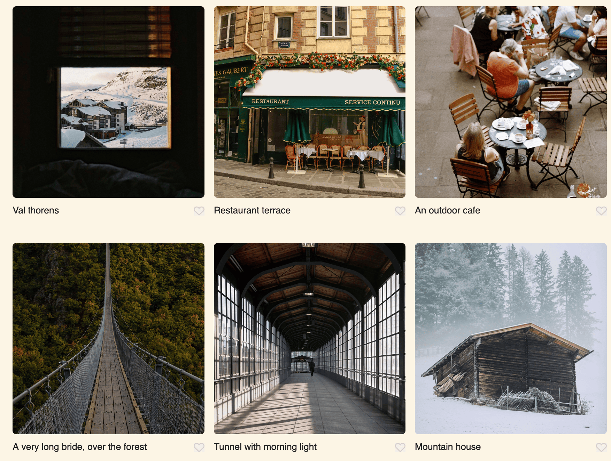
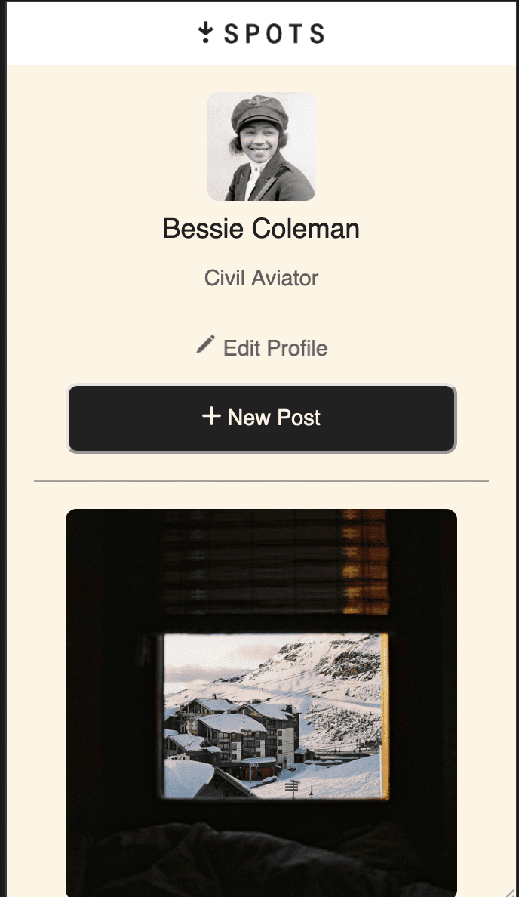

# Spots

## Description

Spots is a modern web-based portfolio for showcasing various destinations or attractions. The project features a user-friendly design, a profile section, and a collection of visually appealing cards, each representing a location with an image, title, and an interactive like button. The project is built to be responsive, ensuring an optimal user experience across devices.

## Features

- **Profile Section**: Displays a user's avatar, name, and description, with options to edit the profile or add a new post.
- **Cards Section**: A grid of cards showcasing different locations with images, titles, and like buttons.
- **Responsive Design**: Ensures the layout adjusts beautifully on different screen sizes.
- **Interactive Elements**: Hover effects and clickable buttons for an engaging user experience.

## Technologies Used

- **HTML5**: Semantic markup for structure.
- **CSS3**: Styling, including Flexbox and Grid for layout and responsive design techniques.

## Techniques

- **BEM Methodology**: For clean and maintainable CSS.
- **Responsive Web Design**: Media queries to adapt the layout for various screen sizes.

## Screenshots

### Profile Section

### Cards Section

### Mobile View

## Deployment

You can view the live project on GitHub Pages:
[Spots on GitHub Pages](https://klaus237.github.io/se_project_spots)

## Video

You can view the video project on loom:
[Spots on loom](https://www.loom.com/share/1bab44bb0e444bb3b8645e44d7abf595?sid=fd298287-a799-4ec6-9f1d-eabb5917e3ae)
